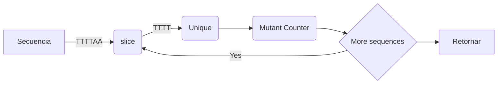
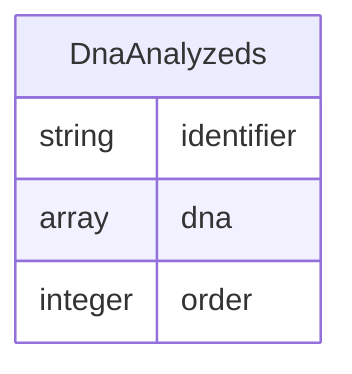

# Problema

Para determinar si un humano es mutante, se necesita encontrar más de una secuencia de cuatro letras iguales, en una cadena de ADN.
(i.e.  ADN: `{"ATGCGA","CAGTGC","TTATGT","AGAAGG","CCCCTA","TCACTG"}`)

Esta cadena debe ser representada en una matriz (NxN), y las secuencias objeto de análisis serán las obtenidas de la matriz de forma oblicua, horizontal o vertical.

| * | * | * | * | * | * |
|---|---|---|---|---|---|
| __`A`__ | T | G | C | __`G`__ | A |
| C | __`A`__ | G | T | __`G`__ | C |
| T | T | __`A`__ | T | __`G`__ | T |
| A | G | A | __`A`__ | __`G`__ | G |
| __`C`__ | __`C`__ | __`C`__ | __`C`__ | T | A |
| T | C | A | C | T | G |

en este caso tenemos 3 secuencias con cuatro letras  iguales `AAAA`. `CCCC` y `GGGG`  y podemos determinar que es ADN mutante.

## Solución

1. Obtener secuencias
De una matriz NxN debemos obtener todas las diagonales, columnas y filas de nuestra cadena de ADN inicial.

2. Analizar cada secuencia bajo las siguientes reglas.
  1. Validar tamaño de la secuencia, si es menor de 4 descartar.
  2. Crear nuestro pivote 0.
  3. Crear contador de secuencias mutantes en 0.
  3. Obtener una porcion de 4 elementos (slice), comenzando en la posicion del pivote.
  4. Calcular la cantidad de elementos unicos en la porcion obtenida.
    - si hay más de un objeto unico aumentar el pivote en 1 y volver al paso 4.
    - en caso de que encontrar solo 1 elemento unico, aumentar nuestro pivote en 3 y contador de secuencias mutantes en 1.
  5. Mientras el pivot sea menor o igual al tamaño de lista de elementos volver al paso 4.
  6. Retornar el numero de secuencias mutantes.

Ejemplo, analizar secuencia `TTTTAA`


# Arquitectura

Aplicacion en Ruby on Rails

## Modulos y clases usadas

A nivel tecnico vamos a tener las siguientes clases para lograr analizar un ADN de forma correcta
- `Dna::Matrix`
- `Dna::SequenceAnalyzer`
- `DnaAnalyzer`

### Class Dna::Matrix
Nuestra abstraccion del objeto matriz que nos permite obtener diagonales, columnas y filas de nuestra cadena de ADN inicial.

ejemplo:
```ruby
# matrix dna
dna = [["A", "T", "G", "C", "G", "A"], ["C", "A", "G", "T", "G", "C"], ["T", "T", "A", "T", "G", "T"], ["A", "G", "A", "A", "G", "G"], ["C", "C", "C", "C", "T", "A"], ["T", "C", "A", "C", "T", "G"]]

dna_matrix = Dna::Matrix.new(dna)
dna_matrix.backward_diagonal
=> [["T"], ["C", "C"], ["A", "C", "A"], ["T", "G", "C", "C"], ["C", "T", "A", "C", "T"], ["A", "A", "A", "A", "T", "G"], ["T", "G", "T", "G", "A"], ["G", "T", "G", "G"], ["C", "G", "T"], ["G", "C"], ["A"]]
```

### Class `Dna::SequenceAnalyzer`
Contiene la logica para procesar una lista de secuencias y determinar cuantas de ellas son mutantes o no

ejemplo:
```ruby
sequence_list = [["C", "C"], ["A", "C", "A"], ["T", "G", "C", "C"]]
sequence_analysis = Dna::SequenceAnalyzer.call(sequence_list)
sequence_analysis.mutan_sequence_counter
=> 0
```

### Class `DnaAnalyzer`
Encapsula todos los procesos necesarios para determinar si una matriz NxN es humana o mutante. hace uso de `Dna::Matrix` y `Dna::SequenceAnalyzer`

ejemplo:
```ruby
dna = ["ATGCGA","CAGTGC","TTATGT","AGAAGG","CCCCTA","TCACTG"]
analyzer = DnaAnalyzer.call(dna)
analyzer.mutant?
=> true
```

### Model `DnaAnalyzed`
Este modelo nos permite almacenar en base de datos un registro de cada una de los ADN analizados y conocer de que orden son (humano, mutante)



- identifier: corresponde al hash(sha512) del DNA analizado y nos permite encontrar un identificador unico de la cadena de ADN
- dna: DNA enviado por el usuario.
- order: enum que nos permite identificar si es humano o mutante.


## End points

### /mutant
Recibe un arreglo de strings que representa una cadena de ADN y response codigos de status si el adn analizado es mutanto o humano.
- si el ADN ya fue previamente analizado, se entregara el resultado previamente calculado.

### /stats
Permite obtener las estadisticas de los analisis realizados
